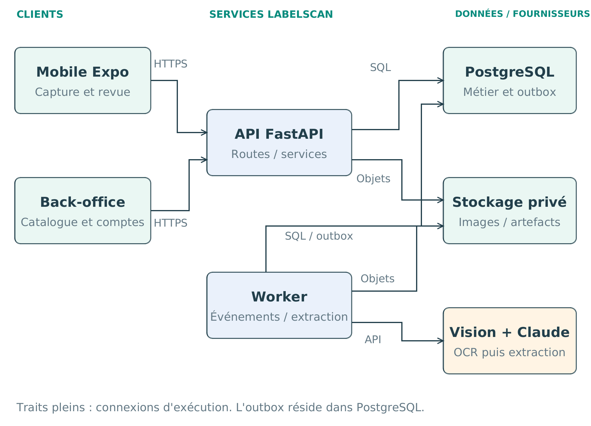
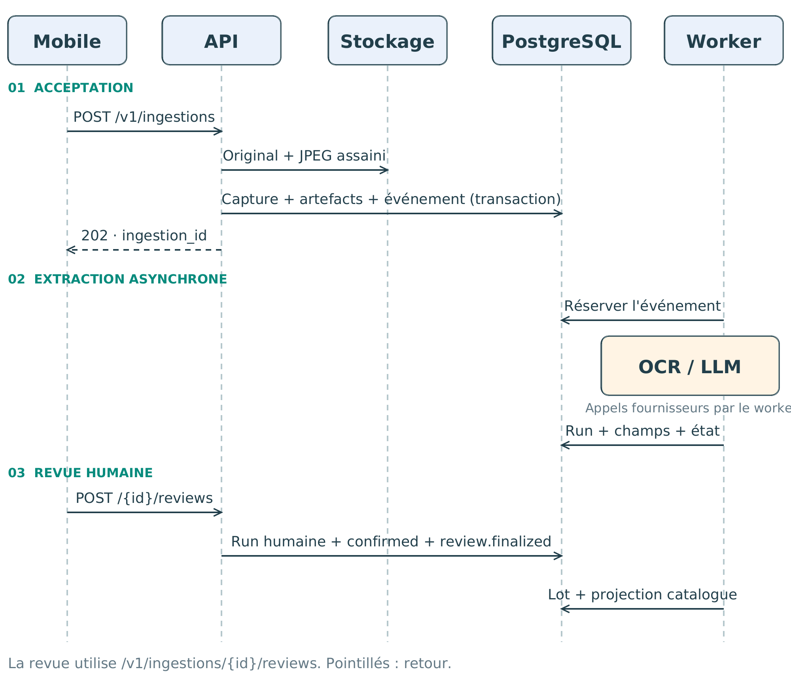
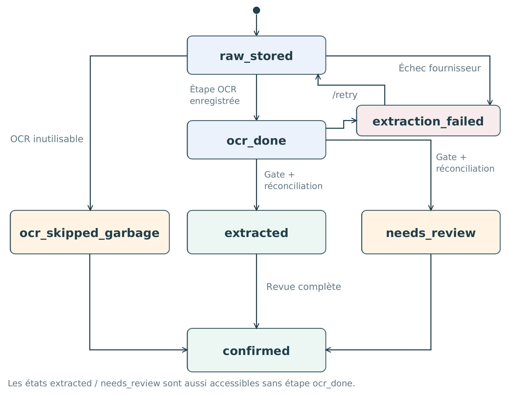
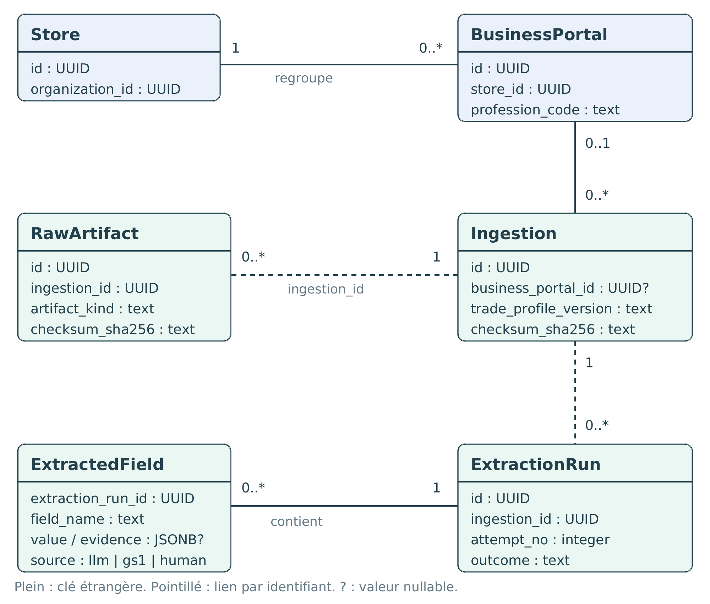

# Documentation LabelScan

Comprendre le produit, démarrer le projet et retrouver les preuves dans le code. Deux documents complémentaires constituent le cœur de la documentation ; une édition PDF les réunit.

## Choisir son parcours

| Besoin | Document |
|---|---|
| Découvrir les usages, les métiers et les échanges | [Documentation technique illustrée](TECHNICAL-DOCUMENTATION-FR.md) |
| Installer, lire le code, tester et comprendre la livraison | [Guide pédagogique du dépôt](GUIDE-DU-DEPOT.md) |
| Présenter les réalisations sous l'angle RNCP niveau 5 | [Compétences et preuves techniques](GUIDE-DU-DEPOT.md#rncp) |
| Lire hors ligne ou imprimer | [Édition PDF complète, 34 pages](../output/pdf/LabelScan_Documentation_Technique.pdf) |
| Consulter les routes et les schémas HTTP | [Contrat OpenAPI](backend/openapi.v1.yaml) |

Les entrées spécialisées restent courtes : [serveur](../server/README.md), [démonstration locale](../server/demo/README.md), [déploiement](../deploy/README.md).

## Schémas visibles sur GitHub

Les aperçus PNG ci-dessous s'affichent directement dans GitHub. Cliquer sur une image permet de l'ouvrir en grand. Les mêmes définitions graphiques produisent le PDF vectoriel et la [planche Excalidraw éditable](diagrams/labelscan.excalidraw).

### 1. Composants : qui communique avec qui ?

Le mobile et le web utilisent l'API. Le worker prend en charge les événements et appelle les fournisseurs d'extraction. La base et le stockage d'images ont des responsabilités distinctes.



[Lire l'architecture](TECHNICAL-DOCUMENTATION-FR.md#architecture)

### 2. Séquence : quand la capture devient-elle une fiche ?

L'acceptation HTTP, l'extraction et la revue sont trois temps séparés. La publication catalogue suit l'enregistrement de la revue humaine.



[Lire la séquence](TECHNICAL-DOCUMENTATION-FR.md#sequence)

### 3. États : comment lire l'avancement ?

L'état d'ingestion décrit l'étape technique. La confirmation humaine distingue une proposition extraite d'une fiche revue.



[Lire les transitions et leurs variantes](TECHNICAL-DOCUMENTATION-FR.md#etats)

### 4. Données : comment conserver la provenance ?

Le modèle relie le magasin, le portail, la capture, ses artefacts et les versions de ses champs. La légende distingue les clés étrangères des liens par identifiant.



[Lire le modèle relationnel](TECHNICAL-DOCUMENTATION-FR.md#modele)

## Éditer les schémas

Télécharger [labelscan.excalidraw](diagrams/labelscan.excalidraw) avec le bouton de téléchargement du fichier, puis l'ouvrir dans Excalidraw. Ce fichier conserve les formes et textes modifiables ; les PNG sont les aperçus de lecture.

## Régénérer la documentation

Le [générateur](../scripts/build_documentation.py) utilise les deux Markdown comme sources éditoriales et des définitions de schémas communes aux trois formats. Il vérifie les débordements de page et le plafond de 50 pages.

Prérequis : Python 3.11+, ReportLab, les polices DejaVu Sans et Poppler (`pdftoppm`). Depuis un environnement Python activé, à la racine :

```bash
python -m pip install reportlab
python scripts/build_documentation.py
```

`LABELSCAN_DOC_FONT_DIR` permet de fournir le répertoire des polices et `LABELSCAN_DOC_PDFTOPPM` le chemin du convertisseur. Les sauts de page `<!-- page -->` organisent le PDF sans gêner la lecture GitHub.
