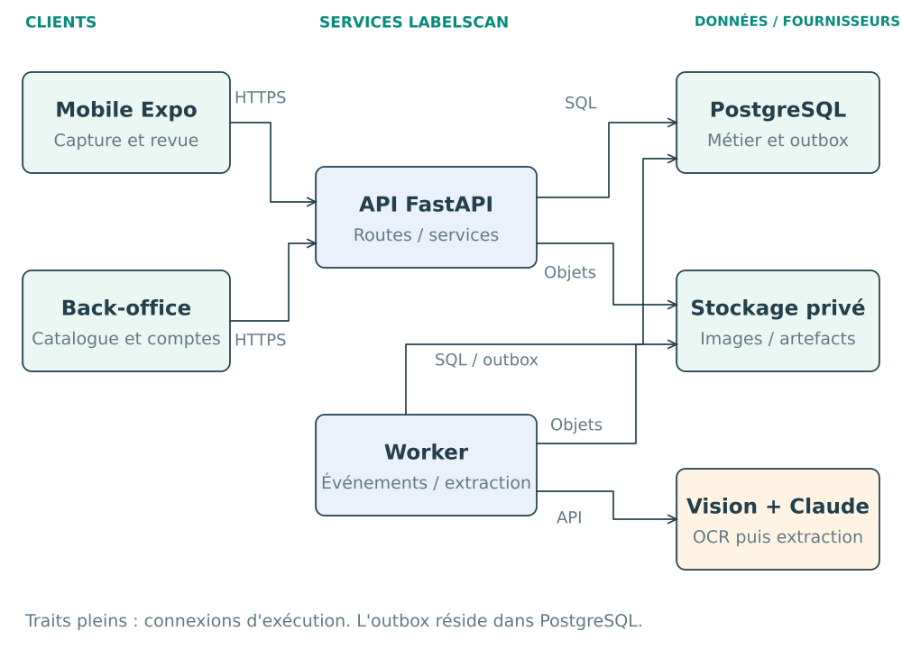
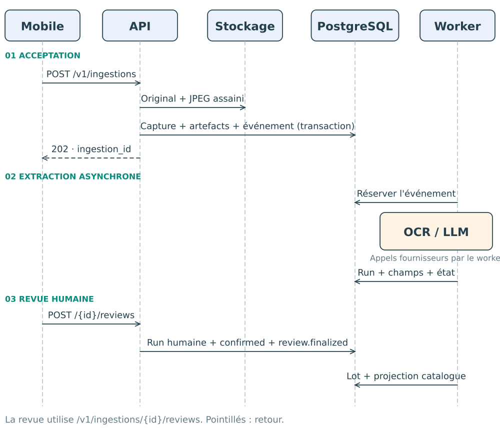
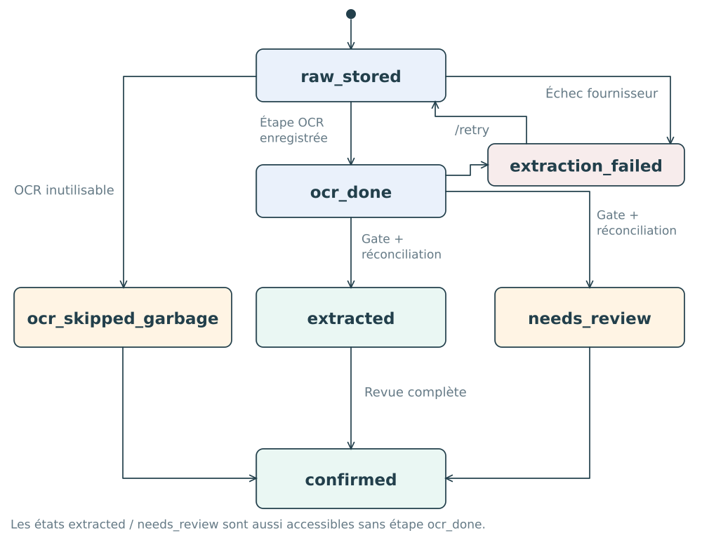
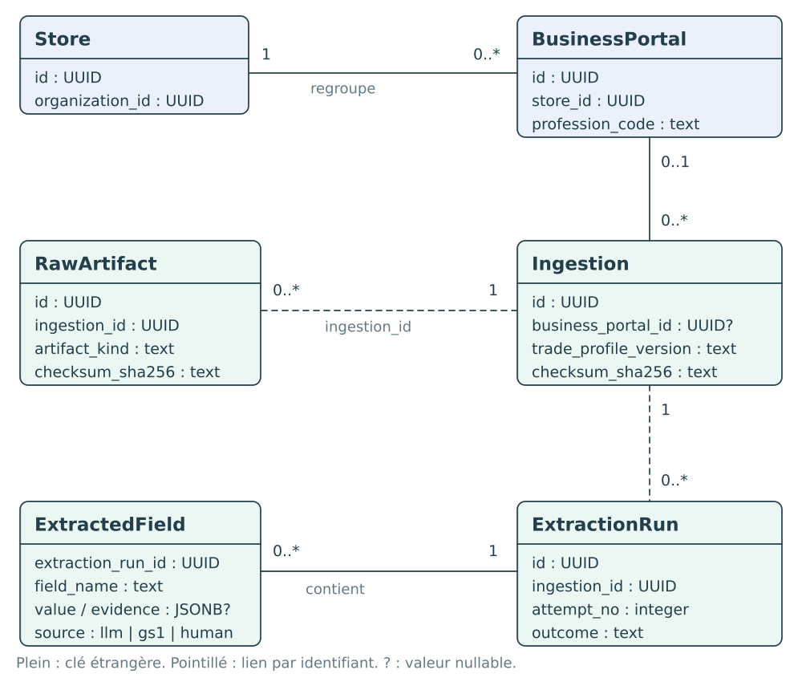

# LabelScan

Documentation technique · Édition septembre 2026

De l'étiquette à la fiche de traçabilité.

<!-- page -->
<a id="lecture"></a>
## Repères de lecture

LabelScan réunit une application de capture mobile, un back-office et un serveur de traitement. Une photo d'étiquette devient une proposition structurée, puis une fiche confirmée par l'opérateur. Cette documentation présente le produit, ses composants et les échanges qui les relient.

| Partie | Contenu |
|---|---|
| 01-06 · Expérience | Produit, parcours, profils, capture, revue et back-office |
| 07-12 · Architecture | Composants, modules, traitement, séquence, états et modèle IA |
| 13-15 · Données | Provenance, modèle relationnel et catalogue |
| 16-18 · Interface API | Familles de routes, capture, revue et consultation |
| 19-21 · Plateforme | Exécution, observabilité et qualité logicielle |
| 22 · Références | Sources exécutables correspondant aux sections |

Les quatre schémas sont des vues UML simplifiées : composants, séquence, états et classes de données. Leurs éléments sont éditables dans le [fichier Excalidraw](diagrams/labelscan.excalidraw). Les noms techniques correspondent aux identifiants du dépôt ; les flèches expriment un appel, une transition ou une association selon la légende.

Le document est une synthèse du code LabelScan. Les numéros de version cités décrivent les dépendances et contrats enregistrés dans le dépôt. Les références S01 à S16 permettent de retrouver les implémentations détaillées. L'[inventaire OpenAPI](backend/openapi.v1.yaml) complète les exemples HTTP.

<!-- page -->
<a id="produit"></a>
## 01 · Le produit

LabelScan accompagne la réception de produits alimentaires. L'opérateur photographie l'étiquette fournisseur, consulte les informations proposées et confirme la fiche qui rejoint le catalogue du magasin. L'image, les extractions et la revue restent reliées à la même capture.

L'expérience articule trois fonctions : **collecter la preuve**, **structurer l'information**, **retrouver l'arrivage**. Elle couvre les métiers Poissonnerie, Boucherie et Charcuterie / Traiteur au sein d'une même plateforme.

| Surface | Fonction principale | Utilisateurs |
|---|---|---|
| Application mobile | Capture, suivi du traitement, revue et consultation | Managers affectés à un portail métier |
| Back-office web | Recherche d'arrivages, détail et administration | Managers, administrateurs et super-administrateurs |
| API | Sessions, captures, extractions, fiches et annuaire | Applications clientes |
| Traitements asynchrones | OCR, extraction, traçabilité et alertes | Services internes |

Un **arrivage** est la vue consultable d'un lot enregistré à partir d'une capture revue. Le **portail métier** rattache ce travail à une organisation, un magasin et une profession. Ce contexte accompagne les données tout au long du traitement.

La fiche garde les champs du profil choisi côté serveur. Les champs qui l'autorisent peuvent recevoir la décision humaine `NC`. Les propositions machine et les décisions humaines portent des sources distinctes dans l'historique.

Références : S01, S02, S03, S04.

<!-- page -->
<a id="parcours"></a>
## 02 · Un parcours de bout en bout

Le parcours commence sur le terrain et se poursuit dans les outils de consultation. Plusieurs captures peuvent être en cours pendant que l'opérateur poursuit sa réception.

| Étape | Action | Résultat |
|---|---|---|
| 1 · Connexion | Le manager ouvre sa session | Le serveur résout le magasin, le portail et le métier |
| 2 · Capture | L'opérateur cadre l'étiquette et déclenche | Une image préparée et son contexte de code-barres sont disponibles |
| 3 · Envoi | Le mobile soumet la capture | L'API retourne l'identifiant de l'ingestion acceptée |
| 4 · Extraction | Les services lisent et structurent l'étiquette | Les propositions apparaissent avec leur état de validation |
| 5 · Revue | L'opérateur renseigne les valeurs et les décisions d'absence autorisées | Une version humaine complète est enregistrée |
| 6 · Consultation | Le catalogue est alimenté | L'arrivage peut être recherché et ouvert sur mobile ou web |

Le mobile associe une carte à chaque scan local. Cette carte permet de suivre l'envoi et le traitement, puis d'ouvrir la revue. Les identifiants locaux et serveur relient les étapes sans demander à l'opérateur de les manipuler.

La reprise réseau conserve la clé d'idempotence de l'opération. Une répétition du même envoi est reconnue côté serveur. Une nouvelle photographie constitue, elle, une nouvelle capture.

La confirmation de revue enregistre le travail de l'opérateur. La publication catalogue s'effectue ensuite par les consommateurs de l'événement `review.finalized`.

Références : S02, S03, S05, S07.

<!-- page -->
<a id="profils"></a>
## 03 · Trois profils métier

Le contrat actif est la version 2. Il partage douze champs et ajoute les champs propres à chaque profession. Le même profil structure l'extraction, la revue et l'affichage de la fiche.

| Profil | Champs | Informations spécifiques |
|---|---:|---|
| Poissonnerie | 16 | Nom scientifique, zone FAO, méthode de production, engin de pêche ou méthode d'élevage |
| Boucherie | 21 | Espèce et catégorie animale, morceau, pays de naissance, élevage, abattage et découpe, agréments d'abattage et de découpe |
| Charcuterie / Traiteur | 21 | Famille, fabricant, ingrédients, additifs, préparation, conditionnement, mode de conservation, utilisation et réchauffage |

Les champs communs sont la désignation commerciale, le producteur, la marque revendeur, le lot, le pays d'origine, les dates de péremption et de conditionnement, la température de conservation, les allergènes, la marque sanitaire, le poids et le GTIN.

Le serveur définit les noms et types canoniques. Les clients présentent les libellés métier et les groupes de champs en français. Le code `charcuterie_traiteur` correspond à un seul profil combiné.

Les dates normalisées utilisent `YYYY-MM-DD`. Le poids accepte `g` et `kg`. Le GTIN couvre les longueurs 8, 12, 13 et 14 avec validation. La méthode de production distingue `wild_caught` et `farmed`.

L'ingestion conserve le code et la version du profil au moment de la capture. Le contrat historique v1 reste résoluble pour ses données ; il comprend le champ prix, retiré de la v2.

Références : S01, S02, S04.

<!-- page -->
<a id="mobile"></a>
## 04 · L'expérience mobile

L'application utilise Expo SDK 57, React Native 0.86 et React 19.2. Sa navigation principale comporte cinq écrans : connexion, articles, caméra, revue et détail d'article.

La caméra affiche un guide de cadrage, une commande de lampe et un déclencheur. Un verrou synchrone évite de lancer deux captures natives simultanément. Sur Android, la caméra suit le focus de l'écran et l'état actif de l'application.

La préparation remet la photo dans l'orientation attendue, applique la géométrie du guide, produit un résultat paysage et écrit un JPEG compressé. Le fichier est copié dans le stockage des captures en attente avant la création de l'opération d'envoi.

| Fonction | Comportement |
|---|---|
| Codes-barres | Détection EAN, UPC, Code 128, Code 39 et QR ; contexte joint à la capture |
| Prises successives | Retour du déclencheur pendant que les envois précédents progressent |
| Suivi | Cartes de scans en cours, résultat disponible ou état d'erreur |
| Photographie | Affichage protégé, zoom, déplacement et rotation selon l'écran |
| Session | Restauration contrôlée avant ouverture du parcours authentifié |

Les états réseau sont intégrés à l'interface. Au démarrage, les échecs temporaires de restauration affichent une attente de connexion et déclenchent des tentatives espacées. Pendant une session ouverte, la file d'envoi permet de conserver du travail à transmettre.

Le contexte de session comprend l'organisation, l'acteur, le portail et le métier. Les opérations locales et les clés de consultation utilisent cette identité complète.

Références : S02, S03, S12.

<!-- page -->
<a id="revue"></a>
## 05 · La revue humaine

L'écran de revue rassemble la photographie et les champs du profil. Il suit le scan local et affiche les résultats disponibles : aperçu intermédiaire puis extraction finale.

Chaque champ reste visible. L'opérateur peut conserver une proposition, la corriger ou saisir `NC` pour les champs qui l'autorisent. La désignation, les dates de péremption et de conditionnement, l'origine, la marque sanitaire, le lot et la température exigent une valeur dans le formulaire. En poissonnerie, cette règle couvre aussi la méthode de production et la zone FAO ; pour l'élevage, la zone FAO reçoit `NC` en l'absence de saisie explicite non vide.

| Élément | Rôle dans la revue |
|---|---|
| Photographie | Support visuel pour confronter la proposition à l'étiquette |
| Valeur proposée | Texte extrait ou issu du code-barres |
| État du champ | Présence, absence, ambiguïté ou état de normalisation |
| Décision humaine | Valeur renseignée ou `NC` explicite |
| Brouillon | Reprise locale de la saisie avant finalisation |

Les contrôles du formulaire portent notamment sur les dates, GTIN, méthodes de production et champs complétés. Les suggestions d'allergènes en poissonnerie sont présentées à l'opérateur pour sélection.

La finalisation transmet l'ensemble exact des champs du profil. Le serveur vérifie la complétude, crée une nouvelle extraction dont les valeurs sont de source humaine, enregistre la rotation et place l'ingestion à l'état `confirmed`.

La run machine reste disponible dans l'historique. La run humaine porte une nouvelle tentative et un nouvel identifiant. L'événement `review.finalized` relie cette décision au traitement de traçabilité.

La fiche enregistrée est consultable depuis la liste et le détail catalogue. L'écran mobile propose également « Modifier la fiche » pour accéder aux corrections unitaires. Les interfaces affichent le profil complet.

Références : S02, S05, S07, S08.

<!-- page -->
<a id="backoffice"></a>
## 06 · Le back-office

Le back-office est une application React servie par le backend. Son adresse suit la forme `/backoffice/o/{organization_slug}/`. Les écrans, filtres et libellés métier sont en français.

| Rôle | Fonctions accessibles dans son périmètre |
|---|---|
| `manager` | Arrivages de son portail et compte personnel ; accès mobile |
| `admin` | Administration déléguée des magasins et portails attribués |
| `super_admin` | Gestion des magasins, administrateurs, managers et arrivages de son organisation |

La recherche combine texte, période et filtres métier. Le serveur applique le périmètre autorisé avant recherche, tri, pagination et comptage. Le détail rassemble les informations du profil et la photographie correspondante.

Les définitions de présentation sont regroupées par profession dans le registre de portails web. Elles organisent les sections, les libellés et l'affichage des champs. L'annuaire relie les magasins, les portails actifs et les comptes affectés.

La session navigateur utilise un token d'accès conservé en mémoire et un cookie de renouvellement géré par le serveur. La navigation suit l'identité résolue ; les demandes de données sont vérifiées par l'API.

Les composants d'interface comprennent des sélecteurs, un calendrier de plage de dates, des filtres et une visionneuse de photo. L'application dispose de tests de composants et de scénarios de parcours Playwright.

Références : S04, S09, S12, S14.

<!-- page -->
<a id="architecture"></a>
## 07 · Vue des composants

Le serveur forme un monolithe modulaire, exécuté dans des processus API et worker distincts. Les applications partagent la même API et le même catalogue métier.



Les traits pleins représentent les échanges d'exécution. Les services OCR et LLM sont appelés par le worker. PostgreSQL conserve les données structurées ; le stockage privé conserve les objets image et les artefacts de traitement.

Le backend construit et sert également les ressources du back-office. L'outbox est une table PostgreSQL reliant les transactions métier aux traitements asynchrones.

Références : S06, S07, S10, S11.

<!-- page -->
<a id="modules"></a>
## 08 · Les modules du serveur

Le code Python est organisé en contextes métier. La couche d'assemblage sélectionne les adapters, construit les services et enregistre les routes et consommateurs.

| Contexte | Responsabilité |
|---|---|
| `identity` | Comptes, sessions, magasins, portails et affectations |
| `ingestion` | Réception de l'image, extraction, corrections et revue |
| `traceability` | Enregistrement des lots et lecture du catalogue |
| `haccp` | Plans de contrôle, relevés et cycle des alertes |
| `audit` | Frontière de l'historique d'audit |
| `compliance` | Frontière réservée dans l'organisation modulaire |
| `platform` | Accès base, HTTP, stockage, outbox et observabilité |

À l'intérieur d'un contexte, les dépendances suivent `adapters → application → domain`. Le domaine exprime les états et règles ; l'application coordonne les ports ; les adapters réalisent les échanges SQL, HTTP, OCR et LLM.

Les workflows transversaux s'appuient sur les identifiants métier et les événements. Le relais outbox et les consommateurs assurent le passage de l'ingestion à la traçabilité, puis aux alertes.

L'architecture concentre la modélisation sur les comportements qui portent des invariants : capture, extraction, revue et cycle d'alerte. Les modules d'annuaire et de lecture restent plus simples. Import Linter vérifie les frontières de dépendances enregistrées dans le dépôt.

Les évolutions de données sont exprimées par les migrations Alembic. Les versions de profil, de prompt et de règle accompagnent les enregistrements concernés.

Références : S06, S07, S10, S14.

<!-- page -->
<a id="pipeline"></a>
## 09 · Du cliché à l'extraction

La requête d'ingestion reçoit les octets de l'image et le contexte autorisé. Elle valide le contenu, calcule son checksum et écrit le fichier via le port de stockage. La transaction SQL enregistre la capture, la référence d'artefact et l'événement `ingestion.raw_stored`.

La réponse HTTP `202` est produite après le commit. Le traitement OCR et LLM est pris en charge par le worker.

| Phase | Traitement | Donnée produite |
|---|---|---|
| GS1 | Décodage et validation des identifiants d'application reconnus | Candidats déterministes et avertissements |
| OCR | Lecture de l'image par Google Vision | Texte, confiance moyenne et informations de page |
| Qualité | Évaluation de l'utilisabilité du texte | Décision de poursuite et aperçu intermédiaire possible |
| LLM | Extraction structurée selon le profil | Champs proposés, confiance, évidence et diagnostics |
| Gate | Vérification des preuves et règles | Champs validés, corrigés ou orientés vers la revue |
| Réconciliation | Application de la priorité GS1 et examen des conflits | Run finale associée à l'ingestion |

Les champs calculables à partir du code-barres sont traités avant le modèle. Leurs noms peuvent être transmis comme indication de travail déjà résolu. La réconciliation applique ensuite cette priorité dans le résultat.

Le worker conserve les artefacts OCR et LLM normalisés et les réutilise lorsqu'ils sont déjà enregistrés. Les tentatives fournisseur sont bornées ; un résultat inutilisable ou un échec de traitement possède un état explicite.

Références : S05, S06, S07.

<!-- page -->
<a id="sequence"></a>
## 10 · Capture et publication

Le diagramme distingue l'acceptation de la capture, l'extraction asynchrone, la revue humaine et l'enregistrement au catalogue.



La validation humaine et l'événement `review.finalized` sont écrits ensemble. Le consommateur de traçabilité enregistre le lot et sa projection ; le mobile et le web retrouvent ensuite l'arrivage par les routes de consultation.

Une flèche en pointillés représente un retour. Les repères numérotés regroupent les trois phases du parcours ; ils rendent explicite la séparation entre acceptation HTTP et publication métier.

Références : S05, S07, S08.

<!-- page -->
<a id="etats"></a>
## 11 · Les états du traitement

L'état de l'ingestion décrit l'avancement serveur. Le résultat de l'extraction et la carte de scan mobile portent des informations complémentaires.



`ocr_done` identifie l'étape OCR enregistrée, avec ou sans champs d'aperçu. `extracted` et `needs_review` décrivent le résultat après gate et réconciliation ; la finalisation humaine conduit à `confirmed`. Le chemin `ocr_skipped_garbage` identifie un OCR jugé inutilisable. Une relance par `/retry` remet une extraction échouée à `raw_stored`.

Le mobile traduit le travail en états de carte : `submitting`, `extracting`, `ready`, `recapture_required`, `submit_error` et `extract_error`. Ces noms concernent le parcours local et ne remplacent pas les états serveur.

Le polling est borné, suspendu en arrière-plan et repris au retour de l'application. Les données d'extraction peuvent être relues depuis leur identifiant serveur.

Références : S03, S05, S07.

<!-- page -->
<a id="contrat-ia"></a>
## 12 · Le contrat de l'IA

Le modèle reçoit le texte OCR, le profil de l'ingestion et les noms de champs déjà résolus. Le JSON retourné possède une propriété `fields`, contenant un sous-ensemble sans doublon des champs autorisés.

```json
{
  "fields": [{
    "name": "commercial_designation",
    "value": "Saumon",
    "confidence": 0.92,
    "evidence": ["Saumon"],
    "validation_status": "present"
  }]
}
```

Cet exemple illustre uniquement le format. `name`, `value`, `confidence` et `evidence` sont les propriétés de base. `validation_status` et `warnings` complètent les diagnostics. Une absence ordinaire peut être omise ; un champ ambigu peut être émis avec une valeur nulle et ses diagnostics.

Les états acceptés sont `present`, `missing`, `ambiguous`, `normalized`, `unnormalizable` et `invalid`. Les valeurs métier sont des chaînes ou `null` ; les preuves sont des listes de fragments textuels.

Le serveur contrôle les noms, doublons, longueurs, tailles d'artefact, confiance et diagnostics. Le gate vérifie l'ancrage exact des preuves dans l'OCR. La confiance d'un champ ancré combine celle du modèle et de l'OCR en prenant la plus basse.

Le prompt détaillé Poissonnerie v2 porte l'identifiant `seafood-label-extraction/v3.3.0`. Les autres profils utilisent un prompt généré à partir de leur contrat. Les règles appliquées et la provenance du traitement sont enregistrées avec la run.

Références : S01, S06, S08.

<!-- page -->
<a id="provenance"></a>
## 13 · Provenance et versions

Chaque proposition possède une origine : traitement d'extraction OCR/LLM, décodage GS1 ou saisie humaine. Cette distinction accompagne les champs stockés et permet de lire l'historique de la capture. Le traitement d'extraction comprend aussi des règles OCR déterministes.

| Donnée conservée | Utilité |
|---|---|
| Image originale et SHA-256 | Relier la capture aux octets enregistrés |
| Image assainie | Fournir une représentation adaptée aux traitements et lectures |
| Artefact OCR normalisé | Conserver le texte et les métadonnées utilisées par l'extraction |
| Artefact LLM normalisé | Conserver les propositions structurées et leur provenance |
| Extraction run | Identifier tentative, versions et résultat du traitement |
| Champs et preuves | Expliquer chaque valeur proposée et son état |
| Run humaine | Conserver la version décidée par l'opérateur |

Les runs et leurs champs sont ajoutés à l'historique. Une correction crée une nouvelle run et préserve les propositions antérieures. Les lectures utilisent les références de capture et de run pour retrouver les versions.

Les identifiants de corrélation et de trace relient les échanges et événements. L'audit SQL accompagne les mutations des tables qui lui sont rattachées, dans la transaction métier.

Le profil figé conserve le sens de la fiche. Les noms de modèle, de prompt et de règles identifient la configuration de traitement employée. La projection catalogue rassemble les données utiles à la consultation courante.

Références : S06, S08, S10.

<!-- page -->
<a id="modele"></a>
## 14 · Modèle de données

La vue UML ci-dessous regroupe les relations qui relient capture, profil et historique. Les multiplicités indiquent le nombre de lignes associées ; les attributs sont volontairement limités aux identifiants et aux données structurantes.



Le portail appartient à un magasin et porte la profession. L'ingestion référence ce contexte et sa version de profil. Les artefacts et les runs appartiennent à l'ingestion ; les champs appartiennent à une run.

Les entités de catalogue, de session, d'affectation et d'alerte complètent ce noyau. Les migrations SQL décrivent leurs contraintes et relations complètes.

Références : S01, S08, S09, S10.

<!-- page -->
<a id="catalogue"></a>
## 15 · Catalogue et traçabilité

Le consommateur de `review.finalized` vérifie le statut confirmé, la complétude du profil et la source humaine des champs. Il enregistre le lot, les références produit et fournisseur utiles, puis émet `batch.registered` ou `batch.flagged` selon le résultat des contrôles de cohérence.

La projection d'arrivage est une vue de lecture. Elle rassemble les valeurs du profil, le lot, le fournisseur, la date d'enregistrement, l'état et le périmètre de la capture. Elle est créée lors de l'enregistrement du lot issu de la revue complète.

| Consultation | Fonction |
|---|---|
| Liste | Arrivages du périmètre résolu, paginés et triés |
| Recherche | Texte sur les champs projetés, lot et fournisseur |
| Filtres | Période, métier et critères exposés par le contrat |
| Détail | Champs du profil et photographie de l'arrivage |
| Traçabilité | Références de lot et lien avec la capture d'origine |
| Export | Fichier JSON ou CSV généré par le serveur, puis partagé depuis le mobile |

Les requêtes de catalogue appliquent d'abord les critères d'organisation et de portail. Les index couvrent notamment les dates, les dimensions de périmètre et la recherche textuelle sur la projection JSONB.

Le contexte HACCP utilise le plan actif pour les alertes de péremption ; un événement `batch.flagged` produit directement une alerte de cohérence. Une alerte ouverte peut être acquittée puis résolue, ou résolue directement. Ses changements d'état sont audités.

Références : S04, S08, S10, S13.

<!-- page -->
<a id="api"></a>
## 16 · L'interface HTTP

Les applications utilisent l'API versionnée `/v1`. Les corps structurés sont en JSON ; la capture utilise un upload multipart. Les routes de lecture des images fournissent les octets correspondants au contexte autorisé.

| Famille | Routes représentatives |
|---|---|
| Sessions web | `/v1/auth/login`, `/v1/auth/refresh`, `/v1/auth/logout` |
| Session d'organisation | `/v1/o/{organization_slug}/auth/login` |
| Sessions mobiles | `/v1/mobile/auth/login`, `/refresh`, `/logout` |
| Annuaire | `/v1/stores`, `/v1/admins`, `/v1/managers` |
| Ingestion | `/v1/ingestions`, `/v1/ingestions/{ingestion_id}` |
| Résultats | `/v1/extraction-runs/{run_id}` |
| Revue | `/v1/ingestions/{ingestion_id}/reviews` |
| Catalogue | `/v1/professions`, `/v1/arrivals`, `/v1/arrivals/{batch_id}` |
| Export | `GET /v1/arrivals/export` |
| Traçabilité | `/v1/batches/{batch_id}`, `/v1/alerts` |
| Plateforme | `/v1/health/live`, `/v1/health/ready`, `/v1/version` |

La méthode HTTP précise l'opération. L'inventaire OpenAPI contient les schémas, paramètres et réponses des routes implémentées.

Les réponses d'erreur utilisent `application/problem+json` avec un code stable `error_code`, un statut HTTP, une description et un indicateur `retriable`. La corrélation et la trace relient une réponse au traitement associé.

La clé `Idempotency-Key` identifie une mutation rejouable lorsqu'elle est requise par la route. Le même identifiant d'opération est conservé pendant les retries du client.

Références : S05, S09, S13, S15.

<!-- page -->
<a id="api-capture-revue"></a>
## 17 · Capture et revue par API

`POST /v1/ingestions` accepte une image multipart et son contexte de capture. L'identité authentifiée détermine le périmètre métier. La réponse `202` retourne l'identifiant d'ingestion pour suivre le traitement.

La lecture `GET /v1/ingestions/{ingestion_id}` expose l'état, les artefacts et les résultats disponibles. `GET /v1/extraction-runs/{run_id}` ouvre une tentative et ses champs, avec leur confiance, leur source et leur évidence.

| Opération | Effet |
|---|---|
| Soumettre l'image | Enregistrer la capture et programmer l'extraction |
| Lire l'ingestion | Consulter l'avancement et les références du traitement |
| Lire une run | Consulter les champs d'une tentative |
| Finaliser la revue | Enregistrer une version humaine complète et l'événement associé |

La finalisation utilise `POST /v1/ingestions/{ingestion_id}/reviews`. La structure `fields` associe chaque nom de champ à sa valeur finale. Le serveur attend le profil complet, avec des chaînes non vides. Le formulaire mobile applique les règles de valeurs obligatoires décrites à la section 05.

Après validation des valeurs, une transaction vérifie le statut et le profil de l'ingestion verrouillée, ajoute la run humaine et ses champs, enregistre la rotation, confirme l'ingestion et écrit `review.finalized`. Le résultat d'idempotence est conservé avec cette opération.

Les routes de correction unitaire et de confirmation historique existent également dans l'inventaire HTTP. Le parcours mobile de revue complète s'appuie sur `/reviews`, qui porte la finalisation et la publication asynchrone décrites ici.

Références : S05, S08, S15.

<!-- page -->
<a id="api-consultation"></a>
## 18 · Consultation et annuaire

`GET /v1/arrivals` est l'entrée catalogue. Il combine le périmètre autorisé avec les paramètres de recherche, filtres, tri et pagination. Le détail d'un arrivage est adressé par l'identifiant de lot ; sa photographie se consulte par la route image associée.

La liste des professions décrit les profils disponibles. Les clients utilisent leurs définitions métier pour présenter les groupes de champs, formulaires et détails dans un ordre cohérent.

| Ressource | Identité et usage |
|---|---|
| Organisation | Regroupe les magasins et comptes du périmètre |
| Magasin | Représente l'établissement physique |
| Portail métier | Associe organisation, magasin et profession |
| Affectation | Relie un utilisateur à son portail |
| Compte | Porte le rôle et les informations de connexion |
| Arrivage | Conserve les dimensions du contexte lors de son enregistrement |

Les opérations d'annuaire permettent de gérer les magasins et les comptes accessibles au rôle courant. Les portails et affectations portent un état actif. Le contexte courant du manager est résolu à partir de son affectation.

Le changement d'affectation agit sur les accès de session. Les snapshots historiques d'organisation, magasin, portail, métier et acteur restent attachés aux captures et arrivages déjà créés.

Le catalogue offre ainsi une vue actuelle des fiches tout en conservant leur contexte d'origine. Les lectures de lot et d'alerte complètent cette vue pour les fonctions de traçabilité.

Références : S04, S08, S09, S10, S15.

<!-- page -->
<a id="plateforme"></a>
## 19 · La plateforme d'exécution

Le dépôt réunit les sources mobile, web et serveur, ainsi que les fichiers de construction et de déploiement. L'image backend embarque l'API Python et les ressources web compilées.

| Élément | Configuration du dépôt |
|---|---|
| Mobile | Expo SDK 57 ; React Native 0.86 ; React 19.2 |
| Web | React 19, Vite et Wouter |
| Serveur | Python 3.11+ ; image de production Python 3.13 ; FastAPI |
| Base | PostgreSQL 16 ; migrations Alembic |
| Local | Docker Compose : base, migrations, seed, API et quatre workers |
| Managed | API/worker avec base externe et stockage S3-compatible |
| Single-VPS | Composition avec PostgreSQL et volume privé d'images |

Le port de stockage permet aux mêmes services métier d'utiliser un répertoire privé ou un stockage objet. Les paramètres d'environnement sélectionnent la topologie et les adapters.

La configuration distingue le développement et les profils de build mobile. L'adresse d'API est intégrée au bundle par `EXPO_PUBLIC_API_BASE_URL`. Les fichiers `.env.example` décrivent les variables locales et serveur ; les fichiers Compose décrivent leurs dépendances d'exécution.

La démo locale contient neuf arrivages fondés sur des photographies d'étiquettes. Son manifeste versionné relie les images, leurs checksums et les observations de champs. Le seed peuple les comptes et exemples depuis les données de démonstration.

Références : S11, S12, S16.

<!-- page -->
<a id="observabilite"></a>
## 20 · Traitements et observabilité

Le relais outbox sélectionne les événements associés à ses consommateurs enregistrés. Il réclame une ligne éligible avec `FOR UPDATE SKIP LOCKED`, exécute le traitement et enregistre le marqueur de consommation.

| Mécanisme | Fonction |
|---|---|
| Outbox transactionnelle | Conserver les événements produits avec les écritures métier |
| Marqueur `(consumer, event_id)` | Reconnaître les traitements déjà enregistrés |
| Backoff | Espacer les nouvelles tentatives après erreur |
| Dead letter | Identifier les événements ayant épuisé leur budget de reprise |
| Artefacts normalisés | Réutiliser les résultats fournisseur déjà persistés |
| Corrélation et trace | Relier requêtes, événements et traitements |

Les appels externes sont mesurés à la frontière des adapters. Les événements `external_api_metrics` regroupent volumes, succès, erreurs, limitations, appels en cours et latences. La configuration porte les limites d'appels par worker pour Vision et Anthropic.

Le traitement LLM expose également les compteurs de tokens, de création et de lecture de cache ainsi que les identifiants de modèle et de prompt. Le cache du préfixe statique Poissonnerie est conditionné par la mesure du nombre de tokens et les capacités du modèle configuré.

Les endpoints `health/live`, `health/ready` et `version` décrivent respectivement le processus, l'accessibilité de PostgreSQL et du stockage d'objets, et l'identité de version. Les journaux structurés et les états persistés offrent des vues complémentaires de l'exécution.

Références : S06, S07, S11, S13.

<!-- page -->
<a id="qualite"></a>
## 21 · Qualité logicielle

La vérification du dépôt couvre les règles métier, les adapters, les interfaces et la persistance. Les tests utilisent des doubles de fournisseurs pour reproduire les sorties, erreurs et reprises du traitement.

| Couche | Couverture présente |
|---|---|
| Mobile · Jest | Capture, orientation, états de scan, session, outbox, revue et exports |
| Web · Vitest | Routes, périmètres métier, composants, filtres et détails |
| Web · Playwright | Parcours d'accès aux portails et interactions de navigation |
| Backend · Pytest | Profils, OCR, contrat LLM, GS1, évidence, revue, catalogue et HTTP |
| PostgreSQL | Migrations, contraintes, append-only, audit, transactions et périmètres |
| Structure | Typage TypeScript, lint Python, frontières d'import et inventaire OpenAPI |

Les scénarios de reprise reproduisent notamment la répétition d'une requête, le changement d'identité, les erreurs réseau et la réutilisation d'une clé d'idempotence. Les scénarios d'extraction distinguent une valeur ancrée dans le texte, une valeur sans preuve et un conflit avec le code-barres.

Les tests de revue vérifient que le profil est complet et que les valeurs humaines sont associées à une nouvelle run. Les tests de publication suivent l'événement jusqu'au lot et à la projection catalogue.

Le manifeste de démonstration conserve les observations présentes, absentes ou ambiguës par image. Il relie les valeurs à une évidence et à un checksum d'image, ce qui rend les exemples reproductibles.

Les scripts de contrôle et les workflows CI sont versionnés avec l'application. Ils constituent les points d'entrée exécutables de cette couverture.

Références : S03, S14, S16.

<!-- page -->
<a id="references"></a>
## 22 · Références du dépôt

Les chemins ci-dessous identifient les sources de cette synthèse. Les références couvrent les composants décrits et donnent accès aux schémas détaillés.

| Réf. | Source | Contenu |
|---|---|---|
| S01 | [Profils serveur](../server/src/labelscan/business_profiles.py) | Champs, formats et versions |
| S02 | [Écrans](../src/screens/) et [services mobile](../src/services/) | Capture, revue, session et catalogue |
| S03 | [Tests mobile](../src/__tests__/) | Parcours et invariants locaux |
| S04 | [Application web](../web/src/) | Portails, routes et arrivages |
| S05 | [HTTP ingestion](../server/src/labelscan/contexts/ingestion/adapters/http/) | Capture, lecture et revue |
| S06 | [Adapters ingestion](../server/src/labelscan/contexts/ingestion/adapters/) | OCR, LLM et orchestration |
| S07 | [Assemblage](../server/src/labelscan/app/) et [outbox](../server/src/labelscan/platform/outbox/) | Processus et événements |
| S08 | [Traçabilité](../server/src/labelscan/contexts/traceability/) | Lots et projections |
| S09 | [Identité](../server/src/labelscan/contexts/identity/) | Comptes, magasins et portails |
| S10 | [Migrations](../server/migrations/versions/) | Modèle relationnel et contraintes |
| S11 | [Compose local](../docker-compose.yml), [déploiement](../deploy/compose/) | Topologies d'exécution |
| S12 | [Mobile](../package.json), [web](../web/package.json), [serveur](../server/pyproject.toml) | Versions et scripts |
| S13 | [Plateforme HTTP](../server/src/labelscan/platform/http/) et [HACCP](../server/src/labelscan/contexts/haccp/) | Lectures transversales et alertes |
| S14 | [Tests serveur](../server/tests/) et [CI](../.github/workflows/) | Contrôles automatisés |
| S15 | [OpenAPI](backend/openapi.v1.yaml) | Inventaire HTTP généré |
| S16 | [Manifeste démo](../server/demo/manifest.v2.json) et [seed](../server/scripts/seed_demo.py) | Exemples photographiques |

Le PDF et les SVG sont générés à partir de ce texte et des définitions de diagrammes par `scripts/build_documentation.py`. Le fichier Excalidraw rassemble les quatre schémas sur un même canevas éditable.
